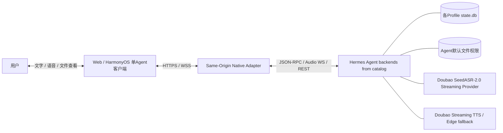
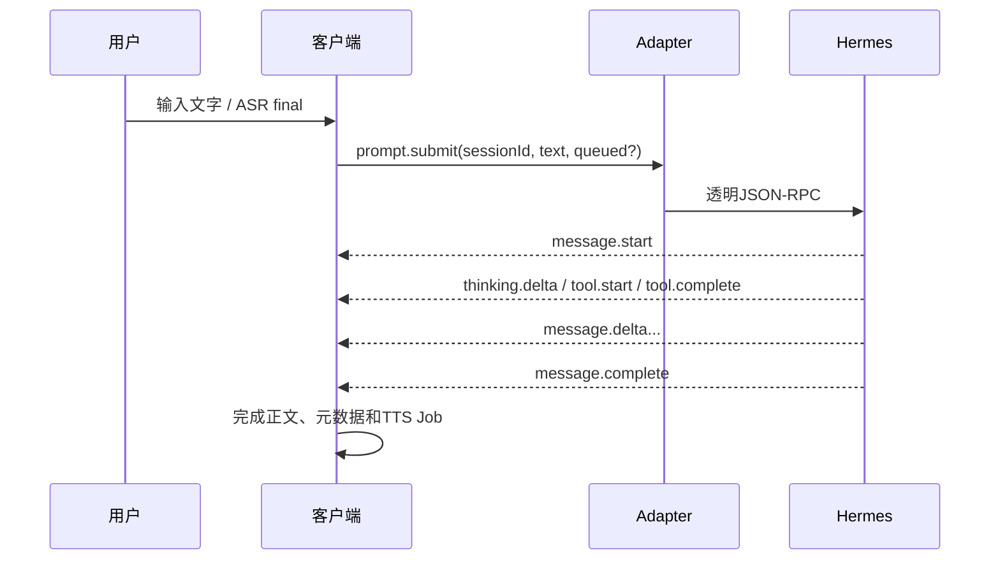
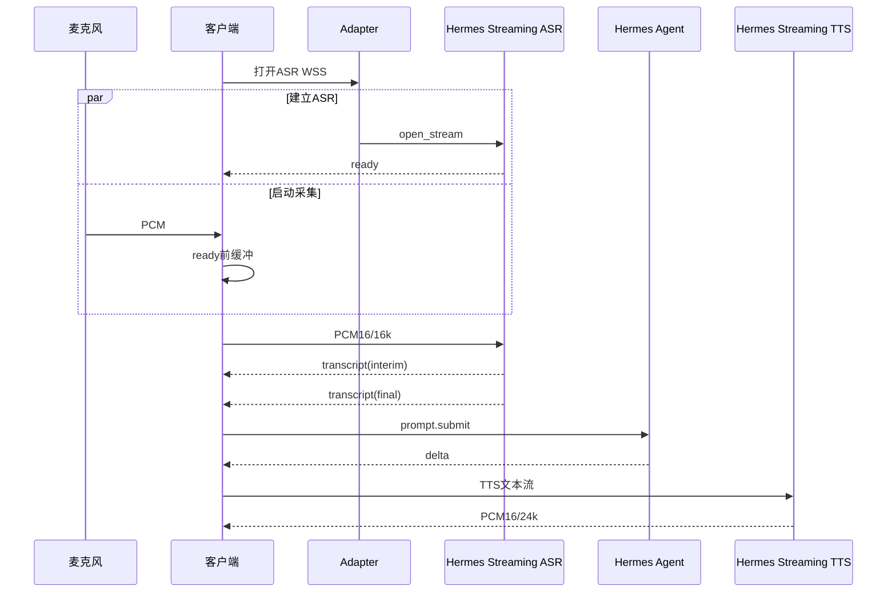
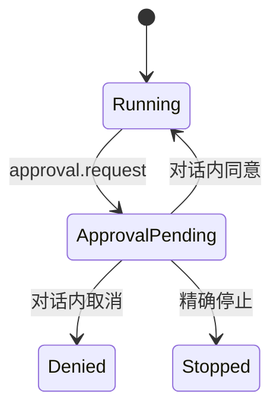

# 单 Agent v22 系统架构

> 适用范围：`native-open-source` 分支和待迁移的单 Agent HarmonyOS 形态。
> 不适用：主持人多 Agent 版。两种形态的边界见 [`PRODUCT_FORMS.md`](./PRODUCT_FORMS.md)。

## 1. 架构目标

单 Agent 版解决一个明确问题：

> 在不重做 Hermes Agent 的前提下，为一个真实 Hermes Profile 提供可持续、可打断、可审批、可传文件、可恢复历史的远程语音客户端。

它不是语音模型套壳，也不是独立 Agent Gateway。Hermes 继续拥有：

- Session 和上下文；
- 模型和 Provider；
- 工具调用；
- 思考与回答；
- 审批和澄清；
- 历史持久化；
- OS/Hermes 文件权限。

客户端和 Adapter 只补上 Hermes 原生远程语音交互缺口。

## 2. 总体拓扑



一次客户端连接只选择一个不透明 Agent ID。切换 Agent 等于切换到另一套隔离的 Hermes 后端和历史，不是主持人调度 Agent。目录由 Adapter 的 `/api/agents` 返回，客户端不写死 Profile。

## 3. 分层与状态所有权

### 3.1 Hermes Core：唯一 Agent 权威

负责：

- `session.create / list / resume / delete`；
- `prompt.submit(queued=true)`；
- `session.interrupt`；
- `config.set(... --session)` 与 `session.info` 运行配置确认；
- `message.start / delta / complete`；
- `thinking.* / tool.*`；
- `approval.request / clarify.request`；
- `session.info`；
- Profile、模型、工具和历史数据库。

禁止 Adapter 或客户端复制：

- Agent 对话上下文；
- 工具路由；
- 模型选择逻辑；
- 审批权限表；
- 多轮消息持久化。

### 3.2 Hermes Voice Provider：语音能力权威

负责：

- 持续 SeedASR-2.0 Session；
- partial / final 转写；
- 流式 TTS；
- Edge TTS fallback；
- Provider 密钥和协议。

Provider Key 只在 Hermes 服务端，不进入 Adapter 静态文件、浏览器或 HAP。

### 3.3 Native Adapter：边界适配

文件：`app/native_main.py`、`app/artifacts.py`。

职责：

1. 校验内部访问口令；
2. 把 Agent Catalog 中的不透明 ID 映射到独立 Hermes `serve --isolated`；
3. 转发 JSON-RPC、ASR WS 和 TTS WS，并在 JSON-RPC 下行链路每 25 秒发送 `gateway.heartbeat`；
4. 聚合 Hermes Session REST 详情和消息时间；
5. 把 Agent 显式选择的 `MEDIA:<path>` 换成 15 分钟随机令牌；
6. 受控代理 Provider / 模型公开选项，不向客户端暴露密钥；
7. 提供同源静态页面。

Adapter 不理解用户意图，不决定补充/纠正/切换，不保存第二套会话。

### 3.4 客户端：设备和交互权威

Web 当前实现：`web_native/`。HarmonyOS 后续使用 ArkTS 原生模块。

负责：

- 麦克风权限和 PCM 采集；
- 播放队列和音频焦点；
- ASR partial/final 气泡；
- TTS 暂停/恢复；
- 页面或原生 UI；
- 历史列表、附件展示；
- 用户从动态目录选择 Agent；
- 用户为当前 Session 选择 Provider / 模型，并等待 `session.info` 确认实际身份。

客户端可以决定“是否听、是否播、显示什么”，不能决定“Agent 实际做了什么”。

## 4. Adapter 接口

### 4.1 HTTP

| 路径 | 鉴权 | 用途 |
|---|---|---|
| `GET /api/agents` | `X-Voice-Token` | 动态 Agent 公开目录（不含 URL、凭据或 Provider 内部配置） |
| `GET /api/health` | `X-Voice-Token` | Agent Catalog 后端状态 |
| `GET /api/hermes/model/options?profile=...` | `X-Voice-Token` | 当前 Agent 可用的 Provider / 模型公开标识及可确认的 `active_provider_label` |
| `POST /api/audio/transcribe` | `X-Voice-Token` | 文件式 ASR fallback |
| `POST /api/audio/speak` | `X-Voice-Token` | 一次性 TTS / 审批提示 |
| `GET /api/hermes/sessions/{id}?profile=...` | `X-Voice-Token` | Session 模型、历史 timestamp 和附件重签 |
| `GET /api/artifacts/{token}` | 随机短期令牌本身 | 图片内联或文件下载 |
| `GET /`、`/assets/*` | 页面口令在运行时使用 | Web UI |

### 4.2 WebSocket

| 路径 | 上游 | 用途 |
|---|---|---|
| `/api/hermes/ws?profile=&token=` | Hermes `/api/ws` | 官方 JSON-RPC Session / Agent 事件 |
| `/api/audio/transcribe-stream?profile=&token=` | Hermes同名路由 | PCM16/16k 持续 ASR |
| `/api/audio/speak-stream?profile=&token=` | Hermes同名路由 | 文本流 → PCM16/24k TTS |

`/api/hermes/ws` 的 Adapter 心跳是下行客户端的应用层保活事件，不转发给 Hermes。客户端收到首个心跳后才启用 70 秒看门狗，因此仍兼容尚未发送心跳的旧 Adapter；心跳事件由网关客户端内部消费，不进入业务事件流。

## 5. Session 身份

必须区分：

| 名称 | 含义 | 生命周期 |
|---|---|---|
| `profile` | Agent 身份和隔离环境 | 目录返回的用户选择 |
| `sessionId` | 当前 Gateway 运行时 ID | 每次 create/resume 生成，可失效 |
| `storedSessionId / session_key` | Hermes 持久会话 ID | 用于历史、恢复、删除 |
| `speechJob` | 客户端一次回答的 TTS 播放任务 | 一轮回答 |
| `artifact token` | 一个显式文件的临时下载凭据 | 15 分钟，进程内存态 |

禁止用运行时 `sessionId` 代替持久历史 ID。

## 6. 正交状态

HarmonyOS 音频的用户环节、控制语义和前后台业务规则以 [`HARMONYOS_AUDIO_USER_JOURNEY.md`](./HARMONYOS_AUDIO_USER_JOURNEY.md) 为准。核心原则是屏幕状态只作为运行环境和诊断维度，不作为 ASR/TTS 业务分支；当前平台资源按实际活动使用专用后台模式，系统 TTS 排队或播放时使用 `AUDIO_PLAYBACK`，其余持续收音窗口使用 `AUDIO_RECORDING`。

### 6.1 客户端状态

```text
connection       = offline | connecting | online
voiceChain       = not_started | running | exiting
inputRouting     = conversation | system_commands_only
asrState         = stopped | connecting | listening | finalizing
agentBusy        = false | true
approvalPending  = false | true
playback         = none | queued | playing | paused_for_user
historyView      = closed | list | resumed
```

### 6.2 核心约束

1. 每次冷启动的完整话筒链路只能由用户手动开启；Agent 完成、TTS结束和关闭/打开话筒不能停止或重启它，退出软件才统一释放。
2. ASR、Agent、TTS 是三条独立生命周期。
3. Agent 生成完成不代表浏览器播放完成。
4. `message.complete` 不能抢断上一条已接受播报。
5. 普通对话模式下，非系统指令的有效 final 必须成为正式用户消息；仅系统指令模式下，普通 final 必须在本地丢弃且不得发送远端。
6. 审批期间普通 final 不得进入 Agent 队列。
7. 历史显示用持久 ID，继续对话用 resume 返回的新运行时 ID。
8. 文件读取权限由 Agent/OS 决定，浏览器不能传服务器路径。
9. 目标语义中，“关闭话筒/打开话筒”只切换 `inputRouting`；`AudioCapturer` 和ASR持续运行。当前 `1.2.1` 停止采集/ASR的行为属于待迁移旧实现。
10. `停止任务`等价于 Hermes `/stop`：取消当前及全部排队任务，清空正文、重读、待播和思考提醒，但不改变输入链路或路由模式。
11. HarmonyOS 语音后端由用户显式选择；`harmony_offline` 失败时不得自动切换或连接远端 ASR/TTS。
12. HarmonyOS 全双工语音统一声明为 `VOICE_COMMUNICATION`，无配件时的通信输出默认设为听筒，用户可以显式切换扬声器；配件选择和麦克风回退由系统自动管理，设备变化只更新诊断与界面状态，不触发手工选路或采集器重建。
13. Gateway 瞬态断线恢复只能重新鉴权并 `session.resume(storedSessionId)`；不得调用会停止语音的手动历史恢复、清空消息或重放 Prompt，独立的 TTS / 播放状态不随网关错误强制归零。
14. `退出软件`统一释放本地输入、输出、后台任务和网络连接并终止应用，且不得残留自动重连；默认不隐式执行远端 `/stop`。

## 7. 文字和 Agent 数据流



繁忙时补充使用 `queued:true`。Adapter 不建立补充表；顺序和上下文由 Hermes 官方 busy input 语义负责。

## 8. 连续语音数据流



## 9. 播放队列

每个 Agent turn 创建一个 `speechJob`：

```text
{text, ttsText, complete, mediaFilter}
```

规则：

- 第一个 Job 激活并开始 TTS；
- 后续回答进入 `speechQueue`；
- Provider `end` 只是“不会再来 PCM”，客户端等待 `speechNext - currentTime` 排空；
- 排空后才释放 Job 并启动下一条；
- exact STOP 清空所有 Job；
- 用户正常补充只暂停当前播放，提交后继续。

## 10. 回音与用户语音

处理顺序：

```text
WebRTC echoCancellation
→ RMS/播放状态
→ ASR partial
→ 连续短语/二元组回音判断
→ 真人语音：暂停TTS
→ ASR final
→ 提交/排队
→ 恢复TTS
```

旧的“共同汉字比例 ≥ 0.45”已废弃，因为正常中文补充可超过 0.7 并被误吞。

## 11. 审批状态



审批是 Hermes 协议状态，不是自然语言主持人意图。HarmonyOS 将请求显示为普通 Agent 对话气泡，但精确回复仍直接调用 `approval.respond`，不进入 `prompt.submit`；`clarify.request` 使用同一对话式展示原则并调用 `clarify.respond`。

## 12. 附件安全模型

```text
Agent明确输出 MEDIA:/path
→ Adapter仅允许 VOICE_ARTIFACT_ROOTS 内的普通文件
→ 拒绝 .env、凭据、SSH、Git等敏感路径
→ 校验可读性和单文件大小上限
→ 随机token + 文件名/MIME/size
→ Web/Harmony只收到token
→ GET /api/artifacts/{token}
```

安全约束：

- 默认只允许 `/tmp`，生产应配置专用artifact目录；
- token只在内存中，15分钟过期或服务重启后失效；
- 历史中的 MEDIA 每次恢复重新签发；
- 图片可内联，其他文件默认作为附件下载；
- 响应包含 `nosniff` 和受限 CSP；
- TTS使用行首 `MEDIA:` 分片过滤器，不朗读路径。

## 13. Hermes 历史

- `session.list(limit=N)`：持久会话列表；
- 首次 `N=20`，滚到底依次 40、60……；
- `session.resume(storedId)`：恢复上下文，返回新运行时 ID；
- Hermes REST：补充每条 `timestamp`、会话 `model` 和附件；
- `session.delete`：当前已绑定会话拒绝删除。

历史 Agent 元数据与实时消息同一 DOM 结构：

```text
赫小码 · gpt-5.6-sol
总计 7.2s · 2026/08/07 17:51:01
```

旧记录没有持久化 thinking/generation 拆分，因此不能伪造。

## 14. 对 Hermes 的源代码扩展

当前单 Agent 形态依赖 Hermes 中新增的豆包流式语音能力：

- `plugins/transcription/doubao`；
- Streaming STT Provider Session；
- `/api/audio/transcribe-stream`；
- 豆包流式 TTS Provider。

这些变化必须作为可重放 diff、独立分支或上游提交维护；升级 Hermes 前必须核对，不能只更新客户端。

## 15. 部署

```text
Hermes default   127.0.0.1:9120
Hermes hexiaoma  127.0.0.1:9121
Hermes hexiaoxin 127.0.0.1:9122
Native Adapter   0.0.0.0:8844
Public           /voice-native/
```

反向代理必须：

- 支持 WebSocket Upgrade；
- 长读写超时；
- `proxy_buffering off`；
- 静态资源 `no-store`；
- 保持路径尾斜杠语义。

## 16. 当前限制

- HarmonyOS 已分离 CoreSpeech 系统 TTS 与应用自管通信 PCM 的 AudioSession 所有权；自动播报、断线恢复后的重读和耳机听感仍需在 `1.1.1` 真机验收中确认；
- 首次HTTP鉴权换取1小时HttpOnly Cookie；上游Hermes仍可能在内部URL使用其协议要求的token；
- 浏览器 ScriptProcessor 是当前稳定实现，后续可换 AudioWorklet；
- 回音文本判断是 AEC 后的兜底，不等于硬件级全双工保证；
- 历史旧记录只保留可验证总耗时，不含 thinking/generation 拆分；
- HarmonyOS 的后台录音、锁屏、音频焦点和蓝牙必须实机验证；
- 单 Agent 版不提供主持人多 Agent 协作。
